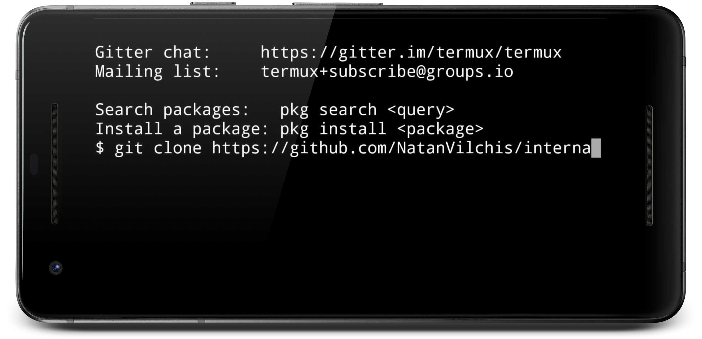
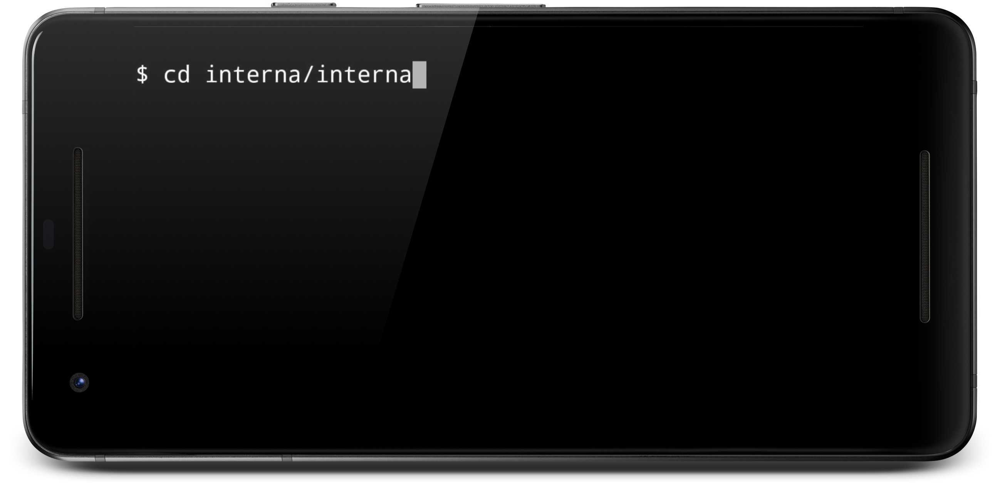
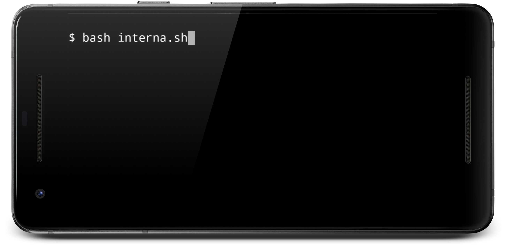

# [Interna] Script to change the current directory to the internal memory directory in Termux (Android)
[](LICENSE)
[](https://www.paypal.me/natanvilchis) <br>

Simple script to change from the current directory to the internal memory <br>

*Read in other languages: [Spanish](README.md), [English](README.en.md)*


 
 
## Tabla de contenido
  - [Pre-requirements](#pre-requirements)
    - [Enable write permissions](#Enable-write-permissions)
    - [Install Git](#Install-Git)
      - [1) Install Git:](#1-Install-Git)
      - [2) Accept the installation of Git:](#2-Accept-the-installation-of-Git)
      - [3) Wait until the installation finishes: ](#3-Wait-until-the-installation-finishes)
  - [Installation](#Installation)
    - [1) Get interna](#1-Get-interna)
    - [2) Open folder interna](#2-Open-folder-interna)
    - [3) Run script interna.sh](#3-run-script-interna)
  - [Example](#example)
 
	
## Pre-requirements

### Enable write permissions
Have the Termux write permissions enabled (Settings => Apps => Termux => Permissions => Storage)


### Install Git
Install Git in Termux:  
#### 1) Install Git:
Execute the following command in termux: <br> 
```
pkg install git
```

 <br>
#### 2) Accept the installation of Git:
 <br>
#### 3) Wait until the installation finishes:
 <br>

## Installation
### 1) Get Interna
In Termux execute the following command:
````
git clone https://github.com/NatanVilchis/interna
````
 <br>
Wait until you finish getting the entire repository: <br>
 <br>
### 2) Open the internal folder
In Termux execute the following command:
````
cd interna/interna
````
 <br>

### 3) Run script interna
In Termux execute the following command:
````
bash interna.sh
````
 <br>

## Example
From any current directory you can write the following:
### Ejecución de interna
````
. interna
````
 <br>
You can verify that you are in the folder of the internal memory with the command ls in Termux
````
ls
````
 <br>


## Made by
[Natan Vilchis](https://natanvilchis.org) <br>

## License
This project is licensed under the MIT license, see [LICENSE](LICENSE) to see the details.
