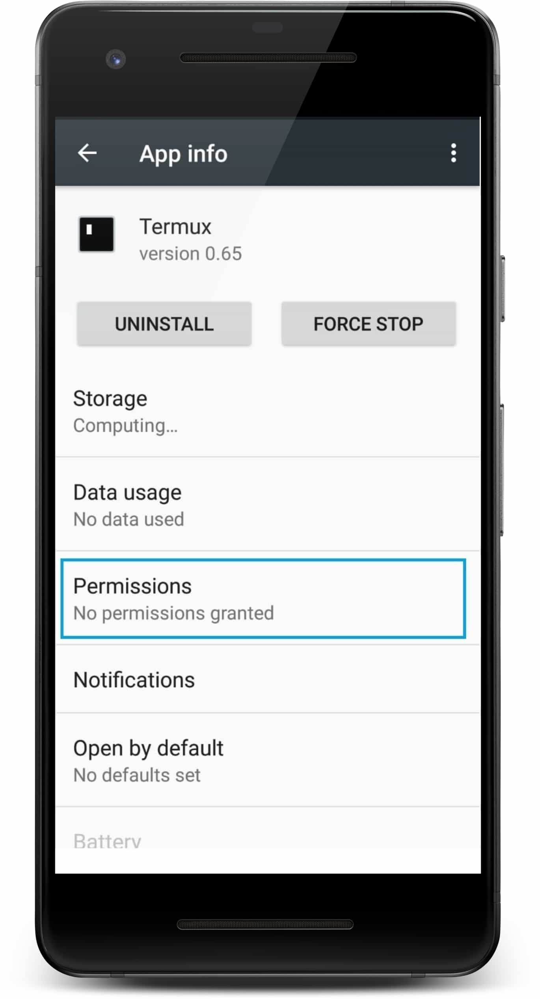
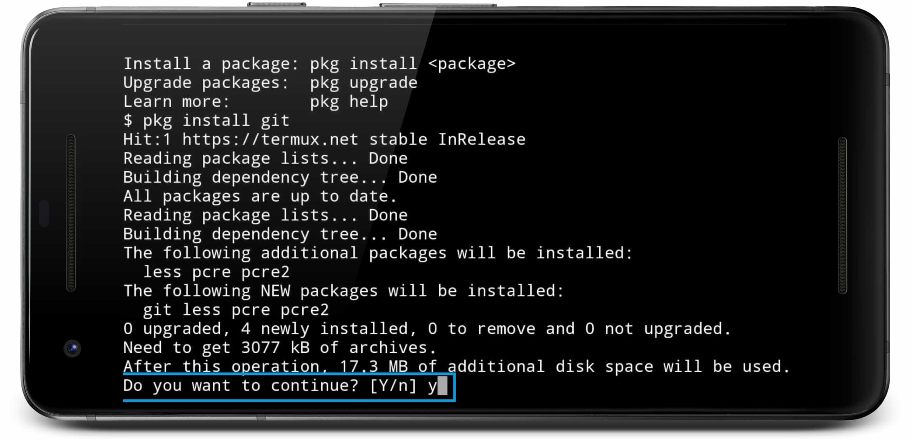
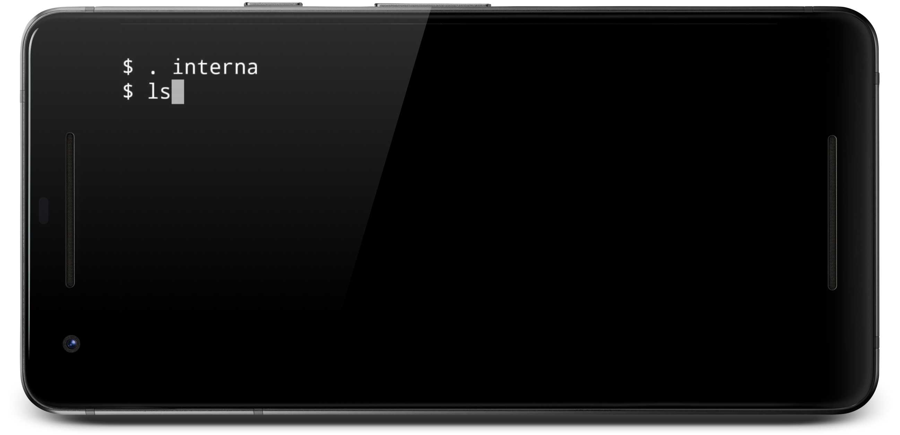

# [Interna] Script para cambiar el directorio actual al directorio de la memoria interna en Termux (Android)
[](LICENSE)
[](https://www.paypal.me/natanvilchis) <br>

Script simple para cambiar del directorio actual a la memoria interna <br>

*Leer en otros lenguajes: [Español](README.md), [Inglés](README.en.md)*


 
 
## Tabla de contenido
  - [Pre-requisitos](#pre-requisitos)
    - [Activar permisos de escritura](#activar-permisos-de-escritura)
    - [Instalar Git](#instalar-git)
      - [1) Instalar Git:](#1-instalar-git)
      - [2) Aceptar la instalación de Git:](#2-Aceptar-la-instalación-de-Git)
      - [3) Esperar hasta que la instalación termine: ](#3-Esperar-hasta-que-la-instalación-termine)
  - [Instalación](#instalacion)
    - [1) Obtener interna](#1-Obtener-interna)
    - [2) Abrir la carpeta interna](#2-Abrir-la-carpeta-interna)
    - [3) Ejecutar el script interna.sh](#3-Ejecutar-el-script-interna.sh)
  - [Ejemplo](#ejemplo)
 
	
## Pre-requisitos

### Activar permisos de escritura
Tener activados los permisos de escritura de Termux (Ajustes => Apps => Termux => Permisos => Almacenamiento)




### Instalar Git
Instalar git en Termux:  
#### 1) Instalar Git:
Ejecutar en termux el siguiente comando: <br> 
```
pkg install git
```


 <br>
#### 2) Aceptar la instalación de Git:
 <br>
#### 3) Esperar hasta que la instalación termine: 
 <br>

## Instalación
### 1) Obtener Interna
En Termux ejecutar el siguiente comando:
````
git clone https://github.com/NatanVilchis/interna
````
 <br>
Esperar a que termine de obtener todo el repositorio: <br>
 <br>
### 2) Abrir la carpeta interna
En Termux ejecutar el siguiente comando:
````
cd interna/interna
````
 <br>

### 3) Ejecutar el script interna.sh
En Termux ejecutar el siguiente comando:
````
bash interna.sh
````
 <br>

## Ejemplo
Desde cualquier directorio actual se puede escribir lo siguiente 
### Ejecución de interna
````
. interna
````
 <br>
Se puede verificar que se encuentra en la carpeta de la memoria interna con el comando ls en Termux
````
ls
````
 <br>


## Hecho por 
[Natan Vilchis](https://natanvilchis.org) <br>

## Licencia
Este proyecto está licenciado bajo la licencia MIT, ver  [LICENSE](LICENSE) para ver los detalles.
